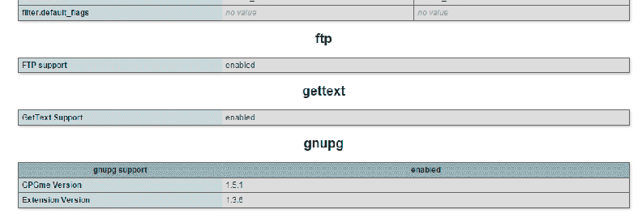

# pgp-2fa
2-Factor-Authentication for the Web with PGP

Wrapper around the GnuPG extension for PHP to make 2-Factor-Authentication with PGP as easy as possible.

<b>PECL-Extension 'GnuPG' is required! (Installation guide below)</b>

<b>Root access to the server is necessary to install the extension!</b>

### Usage

Usage is pretty simple.

Just upload 'pgp-2fa.php' to your webserver and follow the steps below.

If pgp-2fa is used with a standard MySQL-based login, this code has to go on the page where your login form is.
First step is to start the session (if it isn't already started):
```bash
<?php
session_start();
?>
```
Then you have to include the php-2fa class and create a new instance:
```bash
<?php
include('/path/to/pgp-2fa.php');
$pgp = new pgp_2fa();
?>
```
Now you can generate a new secret code. The default length is 15 and it is made out of numbers.
The function to generate the secret code can easily be adjusted for your own needs.
After invoking this function, the unencrypted form of the secret is saved within the instance of the class for the next step, and a hashed and safe form of this secret is stored in the session:
```bash
<?php
$pgp->generateSecret();
?>
```
After generating the secret, you can encrypt it with PGP with a given Public Key:
(In most cases, the public key is stored in a MySQL database so you have to connect to your database and retrieve the public key for the user that is currently logging in)
```bash
<?php
$pgp_message = $pgp->encryptSecret($public_key);
?>
```
The complete code until now should look something like this:
```bash
<?php
session_start();

include('/path/to/pgp-2fa.php');

$pgp = new pgp_2fa();
$pgp->generateSecret();

$pgp_message = $pgp->encryptSecret($public_key);
?>
```
The $pgp_message variable contains the PGP message the user has to decrypt.
This message should be displayed together with an input where the user can type in the decrypted code.

To compare the user given code with the real code , just use compare() in your Form validation process:
```bash
<?php
if($pgp->compare($_POST['user-input'])){
  // Success!
}else{
  // Failure!
}
?>
```

Examples are included!

### How to install the GnuPG PHP Extension
#### 1. Install required packages
```bash
apt-get install build-essential libssl-dev
apt-get install gnupg libgpg-error-dev libassuan-dev libgpgme11-dev
apt-get install php5-dev php-pear
```
#### 2. Download and build GPGME
Go to https://www.gnupg.org/download/ and download the latest GPGME tarball to a writable directory.
Example (replace X.X.X with current version number):
```bash
wget https://www.gnupg.org/ftp/gcrypt/gpgme/gpgme-X.X.X.tar.bz2
```
Then extract the archive and cd to the new directory:
```bash
tar xfvj gpgme-X.X.X.tar.bz2
cd gpgme-X.X.X
```
Configure, make and install GPGME:
```bash
configure
make
make install
```
#### 3. Install the PHP extension:
```bash
pecl install gnupg
```
Open your php.ini and add 'extension=gnupg.so':
```bash
extension=gnupg.so
```
#### Done!

If everything works fine, you should be able to see a new entry in your phpinfo():


